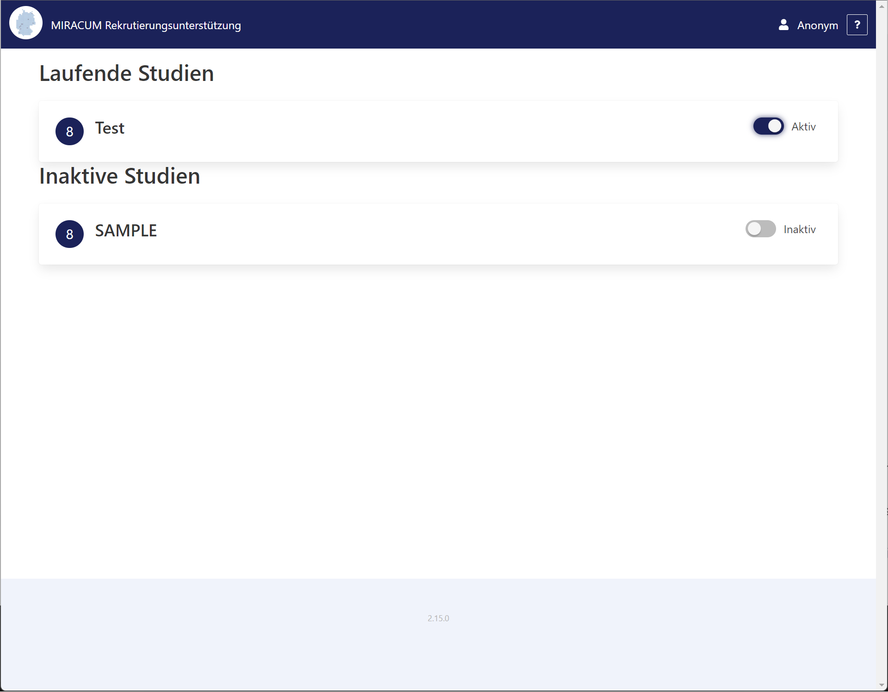

# Customizing the UI

## Configuring columns shown in the screening list

See the `HIDE_DEMOGRAPHICS`, `HIDE_LAST_VISIT`, `HIDE_EHR_BUTTON` options in the
[configuration section for the screening list](./options.md#screening-list).

## Hiding screening lists from the UI

!!! note ""

    Requires `list` module version 2.14 or later

Any user having the `admin` role will note switch controls to mark individual screening lists as "inactive".
These will then no longer show up for regular users.

!!! bug "Known bug"

    Even if a list is marked as inactive, the associated clinical study still counts towards the recommendation
    statistic markers.
