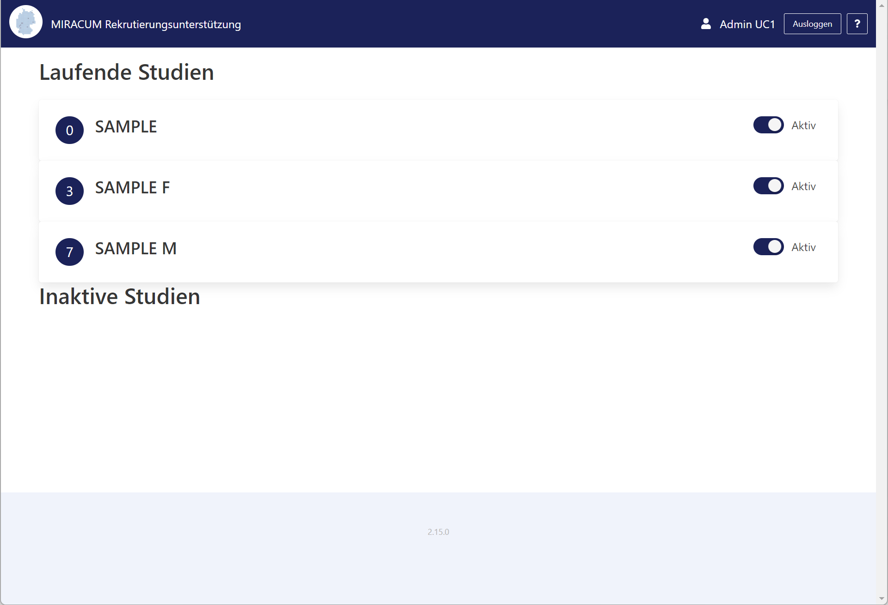
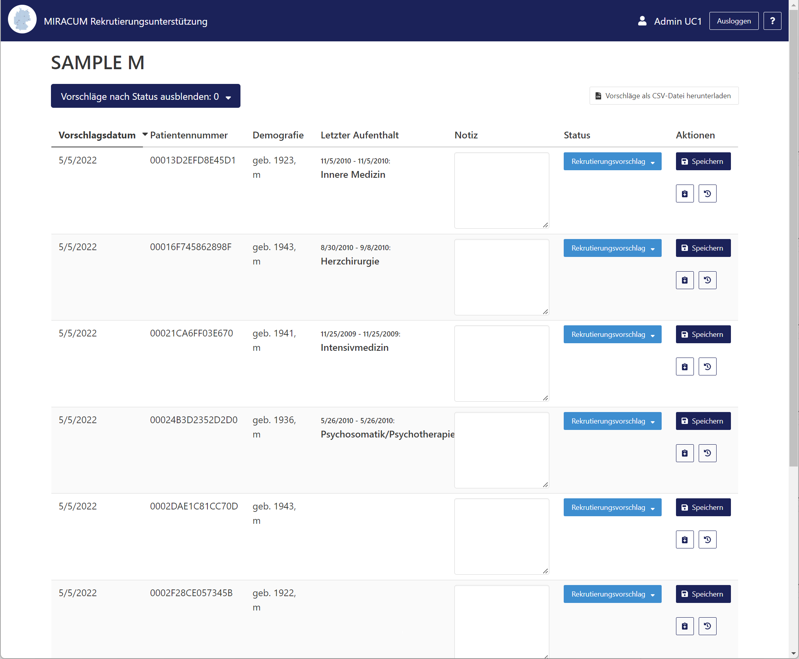
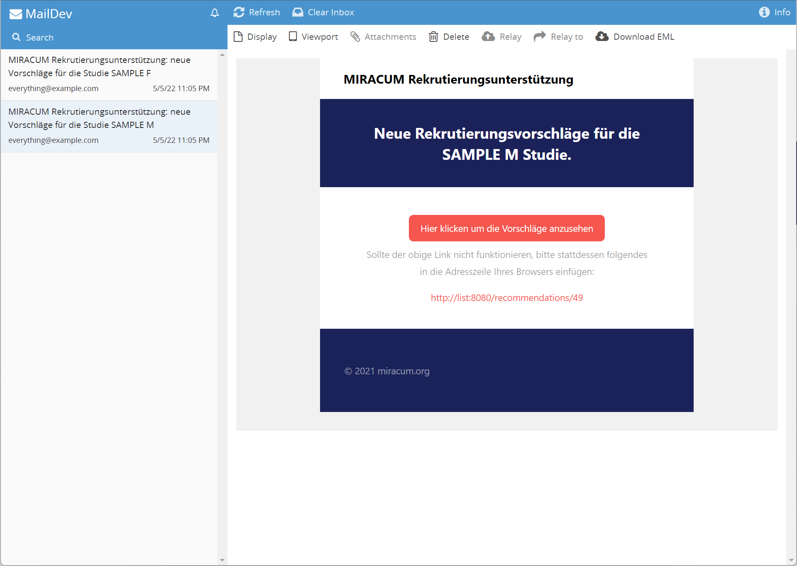

# Docker Compose

The main repository contains the `docker-compose.yaml` files to deploy recruIT via Docker Compose.
The following guides assume that you have cloned it to your current working directory:

```sh
git clone https://github.com/miracum/recruit.git
cd recruit/
```

You can also download a versioned archive of the latest `docker-compose.yaml` files from the tagged releases by visiting
<https://github.com/miracum/recruit/releases> and getting it from the assets.

## Prerequisites

Docker CLI version 20.10.14 or later.

## Installation for local testing using sample data

To run everything locally with Keycloak-based authentication enabled, a sample cohort,
and an OMOP DB filled with sample data:

```sh
docker compose --project-name=recruit \
    --env-file=docker-compose/.staging.env \
    -f docker-compose/docker-compose.yaml \
    -f docker-compose/docker-compose.staging.yaml up
```

You can run the following to probe every component for its health status:

```sh
docker compose --project-name=recruit \
    --env-file=docker-compose/.staging.env \
    -f docker-compose/docker-compose.yaml \
    -f docker-compose/docker-compose.staging.yaml \
    -f docker-compose/docker-compose.probe.yaml run health-probes
```

The `docker-compose.staging.yaml` also includes [Traefik](https://traefik.io/) as a reverse proxy, so you can access the
services running on your local machine on the following named URLs:

| Service                | Ingress URL                                    | Note                                                                                          |
| ---------------------- | ---------------------------------------------- | --------------------------------------------------------------------------------------------- |
| OHDSI Atlas            | <http://recruit-ohdsi.127.0.0.1.nip.io/atlas/> |                                                                                               |
| recruIT Screening List | <http://recruit-list.127.0.0.1.nip.io>         | login with username: `user1` and password: `user1`; Or as `uc1-admin`/`admin` for full access |
| HAPI FHIR Server       | <http://recruit-fhir-server.127.0.0.1.nip.io>  |                                                                                               |
| MailDev                | <http://maildev.127.0.0.1.nip.io>              |                                                                                               |
| Keycloak               | <http://auth.127.0.0.1.nip.io/>                | login with username: `admin` and password: `admin`                                            |

By default, the query module runs every 5 minutes to check for new study candidates. After some time, you should see
the following when opening the screening list at <http://recruit-list.127.0.0.1.nip.io> and logging in as `uc1-admin`/`admin`:



Clicking on the list for the `SAMPLE M` study should show the list of candidates:



Finally, checking the mail viewer at <http://maildev.127.0.0.1.nip.io> you can see the email notifications:



## Standalone installation

The instructions above used the `docker-compose/docker-compose.staging.yaml` to deploy a FHIR server,
a pre-filled OMOP CDM database, the OHDSI tools initialized with sample cohorts, a mock email viewer,
and a pre-configured Keycloak.

The recommended way to install in "production-mode" is to already have deployed all these services and only need to
configure and deploy the recruIT modules. These modules are listed in the `docker-compose/docker-compose.yaml` file.

Several environment variables need to be set before calling `docker-compose -f docker-compose/docker-compose.yaml up`.
You can create a `.env` file in the current directory and set them according to your environment based on the `.staging.env`
example configuration file in the `docker-compose` folder.

You can find a [list of available configuration options here](../configuration/options.md).
