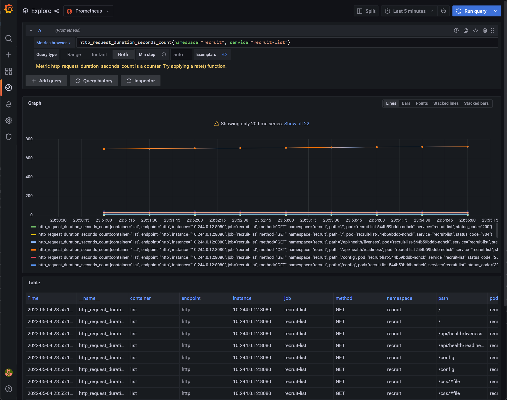

# Kubernetes

## Introduction

A Helm chart for deploying recruIT on a Kubernetes cluster is located in the [MIRACUM charts](https://github.com/miracum/charts)
repository. The chart can be used to deploy the application as well as all dependencies required for it to run ([OHDSI WebAPI](https://github.com/OHDSI/WebAPI),
[OHDSI Atlas](https://github.com/OHDSI/Atlas), [HAPI FHIR server](https://github.com/hapifhir/hapi-fhir-jpaserver-starter)).
The chart also includes [MailHog](https://github.com/mailhog/MailHog), a mock mail server for testing email notifications.

Using the default values provided with the chart, all dependencies are installed and all services are configured to use them.

## Setup

1. Setup a Kubernetes cluster using your cloud provider of choice OR in a local environment using [minikube](https://minikube.sigs.k8s.io/docs/),
   [KinD](https://kind.sigs.k8s.io/), or [k3d](https://k3d.io/).

1. Install [kubectl](https://kubernetes.io/docs/tasks/tools/) and [helm](https://helm.sh/docs/intro/install/)

## Installation

Add the MIRACUM Helm repository by running

```sh
helm repo add miracum https://miracum.github.io/charts
```

then deploy recruIT to a namespace called `recruit` by running

```sh
helm install -n recruit \
  --create-namespace \
  --render-subchart-notes \
  --set ohdsi.cdmInitJob.enabled=true \
  recruit miracum/recruit
```

!!! warning "Auto generated default passwords for the included databases"

    The included HAPI FHIR server, OHDSI, and - if high-availability is enabled - recruIT chart itself depend on the
    [Bitnami PostgreSQL chart](https://github.com/bitnami/charts/tree/master/bitnami/postgresql). By default, this chart
    generates a random password for the `postgres` user unless either `auth.postgresPassword` or `auth.existingSecret`
    are set. Upgrading the release (or simply re-running `helm upgrade --install`) will generate a new password which
    will result in credential errors and the PostgreSQL pod will fail to start. You should therefore overwrite these
    parameters or set them after the initial install. The `--render-subchart-notes` flag above will also print this
    note.

As a quick check to make sure everything is running correctly, you can use the following to check the readiness of all services:

```sh
$ helm test -n recruit recruit

NAME: recruit
LAST DEPLOYED: Wed May  4 21:45:06 2022
NAMESPACE: recruit
STATUS: deployed
REVISION: 1
TEST SUITE:     recruit-fhirserver-test-endpoints
Last Started:   Wed May  4 22:14:23 2022
Last Completed: Wed May  4 22:14:39 2022
Phase:          Succeeded
TEST SUITE:     recruit-ohdsi-test-connection
Last Started:   Wed May  4 22:14:39 2022
Last Completed: Wed May  4 22:14:43 2022
Phase:          Succeeded
TEST SUITE:     recruit-test-health-probes
Last Started:   Wed May  4 22:14:43 2022
Last Completed: Wed May  4 22:14:49 2022
Phase:          Succeeded
NOTES:
1. Get the screening list URL by running these commands:
  http://recruit-list.127.0.0.1.nip.io/
```

## Example installation of the recruIT chart with ingress support using KinD

This will demonstrate how to install recruIT on your local machine using KinD
using the following advanced features:

- create a multi-node Kubernetes cluster to demonstrate topology-zone aware pod
  spreading for high-availability deployments
- expose all user-facing services behing the NGINX ingress controller on a <https://nip.io> domain resolved to localhost
- enable and enforce the restricted [Pod Security Standard](https://kubernetes.io/docs/concepts/security/pod-security-standards/)
  to demonstrate security best practices followed by all components
- pre-load the OMOP CDM database with SynPUF-based sample data

First, create [a new cluster with Ingress support](https://kind.sigs.k8s.io/docs/user/ingress/):

```sh
cat <<EOF | kind create cluster --config=-
kind: Cluster
apiVersion: kind.x-k8s.io/v1alpha4
featureGates:
  PodSecurity: true
nodes:
  - role: control-plane
    image: docker.io/kindest/node:v1.25.3@sha256:f1de3b0670462f43280114eccceab8bf1b9576d2afe0582f8f74529da6fd0365
    kubeadmConfigPatches:
      - |
        kind: InitConfiguration
        nodeRegistration:
          kubeletExtraArgs:
            node-labels: "ingress-ready=true"
    extraPortMappings:
      - containerPort: 80
        hostPort: 80
        protocol: TCP
      - containerPort: 443
        hostPort: 443
        protocol: TCP
    labels:
      topology.kubernetes.io/zone: a
  - role: worker
    image: docker.io/kindest/node:v1.25.3@sha256:f1de3b0670462f43280114eccceab8bf1b9576d2afe0582f8f74529da6fd0365
    labels:
      topology.kubernetes.io/zone: b
  - role: worker
    image: docker.io/kindest/node:v1.25.3@sha256:f1de3b0670462f43280114eccceab8bf1b9576d2afe0582f8f74529da6fd0365
    labels:
      topology.kubernetes.io/zone: c
EOF
```

Install the NGINX ingress controller

```sh
kubectl apply -f https://raw.githubusercontent.com/kubernetes/ingress-nginx/main/deploy/static/provider/kind/deploy.yaml
```

Wait until it's ready to process requests by running

```sh
kubectl wait --namespace ingress-nginx \
  --for=condition=ready pod \
  --selector=app.kubernetes.io/component=controller \
  --timeout=90s
```

Create a namespace for the new installation. Enable and enforce restricted pod security policies:

```sh
kubectl create namespace recruit
kubectl label namespace recruit pod-security.kubernetes.io/enforce=restricted
kubectl label namespace recruit pod-security.kubernetes.io/enforce-version=v1.25
```

Add the MIRACUM chart repository

```sh
helm repo add miracum https://miracum.github.io/charts
```

Save the following as `values-kind-recruit.yaml`, or you can clone this repo and reference the file as `-f docs/_snippets/values-kind-recruit.yaml`.
The `ohdsi.cdmInitJob.extraEnv` option `SETUP_SYNPUF=true` means that the OMOP database will be initialized with SynPUF
1K sample patient data.

!!! info "Documentation for all available chart options"

    You can find a complete description of all available chart configuration options here:
    <https://github.com/miracum/charts/blob/master/charts/recruit/README.md#configuration>

```yaml title="values-kind-recruit.yaml"
--8<-- "_snippets/k8s/values-kind-recruit.yaml"
```

And finally, run

```sh
helm install -n recruit \
  --render-subchart-notes \
  -f values-kind-recruit.yaml \
  --set ohdsi.cdmInitJob.enabled=true \
  --set ohdsi.loadCohortDefinitionsJob.enabled=true \
  recruit miracum/recruit
```

!!! warning "CDM init job"

    The included CDM initialization job is currently not idempotent and may cause problems if ran multiple times.
    You should set `ohdsi.cdmInitJob.enabled=false` when the job has completed once when changing the chart configuration.
    Similarly, you should set `ohdsi.loadCohortDefinitionsJob.enabled=false` to avoid creating duplicate cohort definitions.

The application stack is now deployed. You can wait for the OMOP CDM init job to be done by running the following.
This may take quite some time to complete.

```sh
kubectl wait job \
  --namespace=recruit \
  --for=condition=Complete \
  --selector=app.kubernetes.io/component=cdm-init \
  --timeout=1h
```

At this point, all externally exposed services should be accessible:

| Service                | Ingress URL                                    |
| ---------------------- | ---------------------------------------------- |
| OHDSI Atlas            | <http://recruit-ohdsi.127.0.0.1.nip.io/atlas/> |
| recruIT Screening List | <http://recruit-list.127.0.0.1.nip.io/>        |
| HAPI FHIR Server       | <http://recruit-fhir-server.127.0.0.1.nip.io/> |
| MailHog                | <http://recruit-mailhog.127.0.0.1.nip.io/>     |

The `values-kind-recruit.yaml` used to install the chart automatically loaded a sample cohort defined in
the `ohdsi.loadCohortDefinitionsJob.cohortDefinitions` setting. If the CDM init job completed and the query module
ran at least once, you should see a notification email at <http://recruit-mailhog.127.0.0.1.nip.io/>:

<!-- markdownlint-disable MD033 -->
<figure markdown>
  
  <figcaption>Notification Email for the SAMPLE study displayed in MailHog</figcaption>
</figure>

and the corresponding screening list is accesible at <http://recruit-list.127.0.0.1.nip.io/>:

<figure markdown>
  
  <figcaption>Screening list for the SAMPLE study</figcaption>
</figure>

To create additional studies, follow the [Creating your first study](../getting-started/creating-your-first-study.md)
guide using Atlas at <http://recruit-ohdsi.127.0.0.1.nip.io/atlas/>. Be sure to use `[recruIT]` as the special
label instead of `[UC1]` as the values above override `query.cohortSelectorLabels[0]=recruIT`.

## Metrics

All modules expose metrics in Prometheus format (see [Observability](./observability.md)). The chart makes it easy to scrape
these metrics by integrating with the widely used [Prometheus Operator](https://prometheus-operator.dev/):

```sh
helm repo add prometheus-community https://prometheus-community.github.io/helm-charts
helm install --create-namespace -n monitoring kube-prometheus-stack prometheus-community/kube-prometheus-stack
```

You can now update your release by combining the `values-kind-recruit.yaml` from above with the following:

```yaml title="values-kind-recruit-enable-servicemonitors.yaml"
--8<-- "_snippets/k8s/values-kind-recruit-enable-servicemonitors.yaml"
```

```sh
helm upgrade -n recruit \
  -f values-kind-recruit.yaml \
  -f values-kind-recruit-enable-servicemonitors.yaml \
  recruit miracum/recruit
```

Opening the Grafana instance included with the `kube-prometheus-stack` chart will allow you to query the exposed metrics:

<figure markdown>
  
  <figcaption>Grafana Explore view of some metrics for the list module</figcaption>
</figure>

## High-Availability

The FHIR server, the screening list, and the notification module support running using multiple replicas to ensure
high-availability in case of individual component failures.
Scaling up the notification module requires setting up a backend database for persistence to avoid sending duplicate emails.
Setting `notify.ha.enabled=true` and `postgresql.enabled=true` in the values will deploy an integrated PostgreSQL database
for the notification module. See the options under the `notify.ha.database` key for specifying a custom database to use.

The snippet below configures the release to run multiple replicas of any supporting service, enables [pod disruption budget](https://kubernetes.io/docs/tasks/run-application/configure-pdb/)
resources, and uses [pod topology spread constraints](https://kubernetes.io/docs/concepts/workloads/pods/pod-topology-spread-constraints/)
to spread the pods across node topology zones.

For information on setting up recruIT with highly-available PostgreSQL clusters provided by [CloudNativePG](https://cloudnative-pg.io/),
see [below](#cloudnativepg-for-ha-databases).

```yaml title="values-kind-recruit-ha.yaml"
--8<-- "_snippets/k8s/values-kind-recruit-ha.yaml"
```

## Service mesh integration

The application can be integrated with a service mesh, both for observability and to secure service-to-service
communication via mTLS.

### Linkerd

The following `values-kind-recruit-linkerd.yaml` shows how to configure the chart release
to place Linkerd's `linkerd.io/inject: enabled` annotation for all service pods (excluding pods created by Jobs):

```yaml title="values-kind-recruit-linkerd.yaml"
--8<-- "_snippets/k8s/values-kind-recruit-linkerd.yaml"
```

<figure markdown>
  
  <figcaption>Linkerd dashboard view of the recruiT deployment</figcaption>
</figure>

You can also use the `linkerd.io/inject: enabled` on the `recruit` namespace, see <https://linkerd.io/2.11/features/proxy-injection/>
but you will have to manually add a `disabled` annotation to the OHDSI Achilles CronJob and init job.

### Istio

Add a namespace label to instruct Istio to automatically inject Envoy sidecar proxies when you deploy your application later:

```sh
kubectl label namespace recruit istio-injection=enabled
```

To disable sidecar proxy injection for the Achilles and OMOP CDM init job, see the following values.yaml:

```yaml title="values-kind-recruit-istio.yaml"
--8<-- "_snippets/k8s/values-kind-recruit-istio.yaml"
```

<figure markdown>
  
  <figcaption>Kiali dashboard view of the recruiT deployment</figcaption>
</figure>

## Zero-trust networking

To limit the communication between the components you can deploy [Kubernetes NetworkPolicy](https://kubernetes.io/docs/concepts/services-networking/network-policies/)
resources. Because the details of a deployment can differ significantly (external databases, dependencies spread across
several namespaces, etc.), no generic `NetworkPolicy` resources are included in the Helm chart. Instead, the following
policies and explanations should provide a starting point for customization.

The policies are based on these assumptions:

1. the recruit application is deployed in a namespace called `recruit`
1. the OHDSI stack is deployed in a namespace called `ohdsi`
1. the SMTP server is running on a host outside the cluster at IP `192.0.2.1` and port `1025`
1. the Prometheus monitoring stack is deployed in a namespace called `monitoring`

You can use <https://editor.cilium.io/> to visualize and edit individual policies
or <https://orca.tufin.io/netpol/#> to have the entire policies explained.

```yaml title="recruit-network-policies.yaml"
--8<-- "_snippets/k8s/recruit-network-policies.yaml"
```

## Distributed Tracing

All services support distributed tracing based on OpenTelemetry.

For testing, you can install the Jaeger operator to prepare your cluster for tracing.

```sh
# Cert-Manager is required by the Jaeger Operator
# See <https://cert-manager.io/docs/installation/> for details.
kubectl apply -f https://github.com/cert-manager/cert-manager/releases/download/v1.9.1/cert-manager.yaml

kubectl wait --namespace cert-manager \
  --for=condition=ready pod \
  --selector=app.kubernetes.io/instance=cert-manager \
  --timeout=5m

kubectl create namespace observability
kubectl create -n observability -f https://github.com/jaegertracing/jaeger-operator/releases/download/v1.38.0/jaeger-operator.yaml

kubectl wait --namespace observability \
  --for=condition=ready pod \
  --selector=name=jaeger-operator \
  --timeout=5m

cat <<EOF | kubectl apply -n observability -f -
# simple, all-in-one Jaeger installation. Not suitable for production use.
apiVersion: jaegertracing.io/v1
kind: Jaeger
metadata:
  name: simplest
EOF
```

The following values enable tracing for the query, list, and notify module, the HAPI FHIR server and the OHDSI WebAPI:

```yaml title="values-kind-recruit-tracing.yaml"
--8<-- "_snippets/k8s/values-kind-recruit-tracing.yaml"
```

<figure markdown>
  
  <figcaption>Jaeger Trace Graph view of a single scheduled run of the query module</figcaption>
</figure>

<figure markdown>
  
  <figcaption>Jaeger Trace timeline for interacting with the screening list</figcaption>
</figure>

## Screening List De-Pseudonymization

!!! info

    Requires version 9.3.0 or later of the recruIT Helm chart.

You can optionally deploy both the [FHIR Pseudonymizer](https://github.com/miracum/fhir-pseudonymizer) and
[Vfps](https://github.com/miracum/vfps) as a pseudonym service backend to allow for de-pseudonymizing
patient and visit identifiers stored in OMOP or the FHIR server prior to displaying them on the screening list.

The background is detailed in [De-Pseudonymization](../configuration/de-pseudonymization.md).

The following values.yaml enable the included FHIR Pseudonymizer and Vfps as a pseudonym service.
When Vfps is installed, it uses another PostgreSQL database which is naturally empty and does not contain
any pre-defined namespaces or pseudonyms. It is up to the user to pseudonymize the resources stored inside
the FHIR server used by the screening list.

```yaml title="values-kind-recruit-de-pseudonymization.yaml"
--8<-- "_snippets/k8s/values-kind-recruit-de-pseudonymization.yaml"
```

## CloudNativePG for HA databases

Install the CloudNativePG operator first
[by following the official documentation site](https://cloudnative-pg.io/documentation/1.18/installation_upgrade/):

```sh
kubectl apply -f https://raw.githubusercontent.com/cloudnative-pg/cloudnative-pg/release-1.18/releases/cnpg-1.18.0.yaml
```

Next, create PostgreSQL clusters and pre-configured users for OHDSI, the HAPI FHIR server, the Vfps pseudonymization service,
and the notify module:

```yaml title="cnpg-clusters.yaml"
--8<-- "_snippets/k8s/cnpg-clusters.yaml"
```

```sh
kubectl apply -f cnpg-clusters.yaml
```

Finally, install the recruIT chart using the following updated values.yaml:

```yaml title="values-kind-recruit-with-cnpg.yaml"
--8<-- "_snippets/k8s/values-kind-recruit-with-cnpg.yaml"
```
