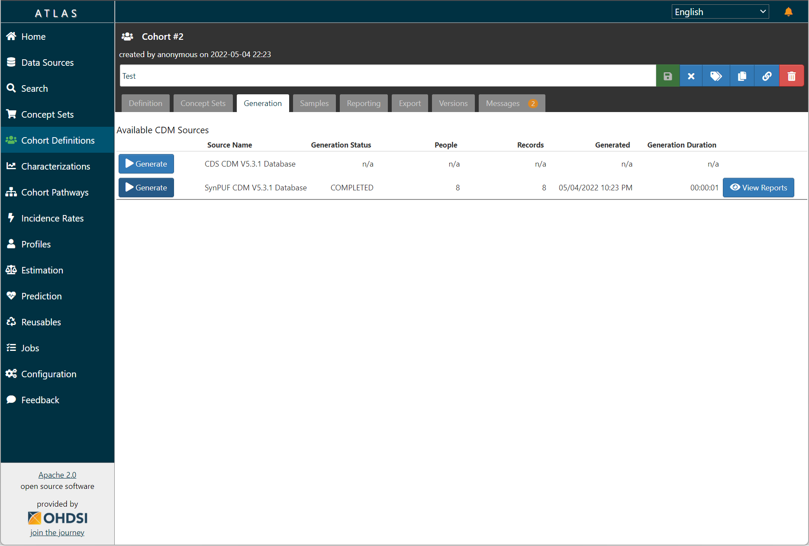
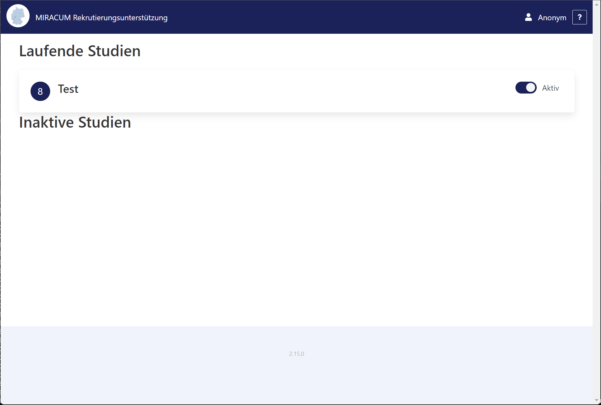

# Creating your first study

This will guide you through creating your first study using recruIT.

recruIT uses the [OHDSI Atlas](https://ohdsi.github.io/TheBookOfOhdsi/OhdsiAnalyticsTools.html#atlas) tool to create
cohorts that define the eligibility criteria for a clinical trial.

Start by opening Atlas and clicking on `Define a New Cohort`:

Now, give the cohort a name (`"Test"`) and description (`"Test cohort for recruIT"`).
Using the `Cohort Entry Events` and `Inclusion Criteria` sections, you can define the criteria
a patient must fulfill in order to be included in the study. See [this chapter](https://ohdsi.github.io/TheBookOfOhdsi/Cohorts.html#Cohorts)
in the book of OHDSI for more information on defining cohorts.

Save the cohort by clicking the top-right green `Save` button.

For testing purposes, you can already generate the cohort by clicking on the `Generation` tab
and clicking the `▶️ Generate` button for the desired CDM source.

You can use the `Samples` tab to view a sample of patients within that cohort and take a look at their health data to help
with tuning your criteria:

If you are happy with your cohort, you can indicate to the `query` module that this cohort should be regularly
re-generated and should appear in the screening list UI. To do so, you have to add a special text to either the description
or the title of the cohort. By default and for historical reason, that label is `[UC1]`. This label is configurable
on the `query` module using either the `QUERY_SELECTOR_MATCHLABELS` environment variable (when deploying via Docker Compose)
or the `query.cohortSelectorLabels` value (when deploying via Helm).

Add this label to either the title or the description and save the cohort again:

After some time (depending on the module's `QUERY_SCHEDULE_UNIXCRON`/`query.schedule` setting) the `query` module should
detect this cohort definition, generate the cohort, and transfer all candidate patients to the FHIR server. At this point,
the study should appear in the screening list overview:

Clicking on it reveals the list of 8 candidate patients:

Depending on your setup, the notification module may also have notified you of the updated screening list entries via email:

Congratulations, you've just created your first cohort definition, displayed potentially eligible patients in the
screening list, and received a notification email about them!
