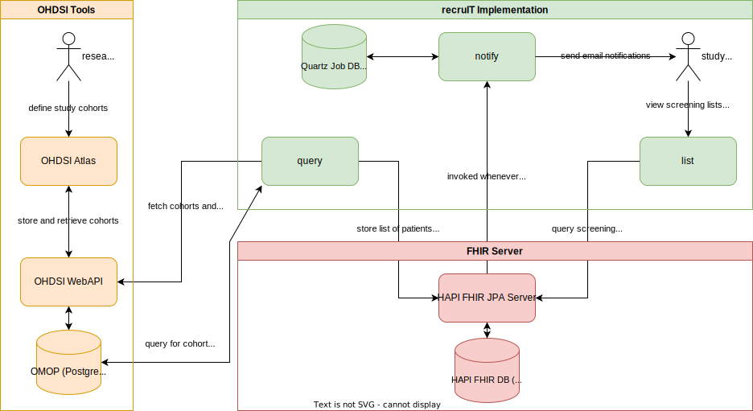

# Introduction

recruIT is a software to assist with the recruitment of patients for clinical trials.

It regularly queries a patient health data repository for potential candidates and displays them on
a list to support manual screening.

It supports querying [OMOP CDM databases](https://www.ohdsi.org/data-standardization/the-common-data-model/)
and eligibility criteria can be defined using [OHDSI Atlas](https://ohdsi.github.io/TheBookOfOhdsi/OhdsiAnalyticsTools.html#atlas).

Internally, the modules communicate using HL7 FHIR® via a central FHIR server.

[Get Started 🚀](./getting-started/installation.md){ .md-button .md-button--primary}

## Architecture

Fundamentally, the design of the application is based on the publication [Design and Multicentric Implementation of a Generic Software Architecture for Patient Recruitment Systems Re-Using Existing HIS Tools and Routine Patient Data](https://dx.doi.org/10.4338%2FACI-2013-07-RA-0047) by Trinczek et al.
Of the 5 presented modules, recruIT implements the notification module (`notify`), the screening list module (`list`),
and the query module (`query`). The patient data module is based on the OMOP CDM, [OHDSI Atlas](https://ohdsi.github.io/TheBookOfOhdsi/OhdsiAnalyticsTools.html#atlas)
is used to define trial metadata.

### Query Module

The query module, also referred to as `query`, uses the [OHDSI WebAPI](https://github.com/OHDSI/WebAPI) to list the
studies ("cohort definitions") [created using OHDSI Atlas](https://ohdsi.github.io/TheBookOfOhdsi/Cohorts.html#Cohorts),
generates them to identify the patients in the OMOP database, maps these OMOP patients to FHIR resources, and finally sends
them to a FHIR server for persistence.

### List Module

The list module (`list`), reads the list of potentially eligible patients from the FHIR server and displays them to the user.
It displays information including the patient identifier, year of birth, and the physical location of the last known stay.
Users can interact with this list by changing the recruitment status for each recommendation and viewing a basic, pseudonymized
patient record.

### Notification Module

The notification module (`notify`) is used to send email notifications to users whenever a screening list is updated
with new candidates. It uses the subscription mechanism of the FHIR server to be updated about additions made by the
query module.
