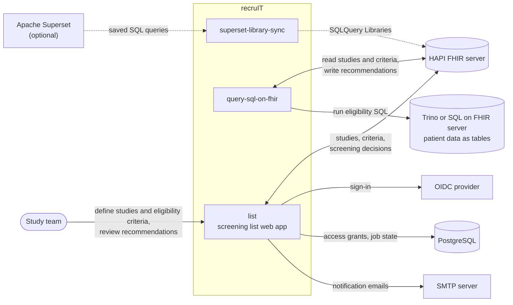

<!-- The hero at the top of this page is defined in overrides/home.html. -->

## Features

<!-- the first card spans two columns, so the five cards fill whole rows; the layout is in _css/extra.css -->
<div class="grid cards rc-features" markdown>

- :lucide-scan-search:{ .lg } **Eligibility criteria as SQL**

    Define a trial's inclusion and exclusion criteria as a cohort using Trino-SQL against
    FHIR ressources encoded as Delta Lake tables. Each criterion is a query that decides, per patient,
    whether it is met:

    ```sql
    SELECT p.id AS patient_id,
           CASE WHEN p.birth_date IS NULL THEN NULL
                ELSE date_diff('year', date(p.birth_date), current_date) >= 18
           END AS is_met,
           CAST(NULL AS BOOLEAN) AS is_indeterminate,
           CAST(NULL AS VARCHAR) AS result_note
    FROM fhir.default.patient p
    ```

    [:octicons-arrow-right-24: Create your first study](getting-started/creating-your-first-study.md)

- :lucide-list-checks:{ .lg } **Screening lists**

    Study teams can review candidates in a web-based screening list: track each one's recruitment
    status, add notes, and view the change history.

- :lucide-mail:{ .lg } **Email notifications**

    Subscribe to email notifications as soon as new candidates are added to one of
    the screening lists, or get updated about new candidates on a regular schedule.

    [:octicons-arrow-right-24: Configuration options](configuration/options.md)

- :lucide-shield-check:{ .lg } **Secure**

    OIDC-based sign-in with the access to screening lists configurable per-user.

    [:octicons-arrow-right-24: Authentication](configuration/options.md#authentication)

- :lucide-cloud:{ .lg } **Cloud-native**

    Deploy with Docker Compose or the Helm chart: high availability, service meshes, network
    policies, Prometheus metrics and OpenTelemetry tracing included.

    [:octicons-arrow-right-24: Deploy on Kubernetes](deployment/kubernetes.md)

</div>

## How it works


```mermaid
flowchart LR
    team(["Study team"])

    subgraph recruit["recruIT"]
        list["list<br/>screening list web app"]
        query["query-sql-on-fhir"]
        sync["superset-library-sync"]
    end

    fhir[("HAPI FHIR server")]
    sql[("Trino or SQL on FHIR server<br/>patient data as tables")]
    superset["Apache Superset<br/>(optional)"]
    db[("PostgreSQL")]
    smtp["SMTP server"]
    oidc["OIDC provider"]

    team -->|"define studies and eligibility criteria,<br/>review recommendations"| list
    list <-->|"studies, criteria,<br/>screening decisions"| fhir
    query <-->|"read studies and criteria,<br/>write recommendations"| fhir
    query -->|"run eligibility SQL"| sql
    superset -.->|"saved SQL queries"| sync
    sync -.->|"SQLQuery Libraries"| fhir
    list -->|"sign-in"| oidc
    list -->|"access grants, job state"| db
    list -->|"notification emails"| smtp
```

recruIT is made up of modules that talk to each other via HL7 FHIR® through a central FHIR server:

1. In the **list** module, the study team defines each study and its eligibility criteria, stored on the
   FHIR server as `ResearchStudy`, `Group` and SQL-based `Library` resources.
2. The **query-sql-on-fhir** module runs each study's eligibility SQL against Trino or a SQL on FHIR server
   and stores the matching patients on the FHIR server as screening recommendations.
3. The **list** module shows these recommendations to the study team, who record their screening decisions,
   and emails the team whenever new recommendations arrive.
4. Optionally, the **superset-library-sync** module turns saved SQL queries from Apache Superset into
   eligibility criteria the other modules can use.

All FHIR resources recruIT uses are described in its [FHIR Implementation Guide](https://open-recruit.github.io/recruit/fhir/).

[:octicons-arrow-right-24: Read the architecture overview](getting-started/introduction.md)

## Published research

recruIT is developed within [MIRACUM](https://www.miracum.org/), a consortium of German university hospitals.
Its design and implementation are described in:

!!! quote ""

    Gulden C, Macho P, Reinecke I, Strantz C, Prokosch HU, Blasini R.
    **recruIT: A cloud-native clinical trial recruitment support system based on Health Level 7 Fast Healthcare
    Interoperability Resources (HL7 FHIR) and the Observational Medical Outcomes Partnership Common Data Model (OMOP CDM).**
    _Computers in Biology and Medicine_. 2024;174:108411.
    [doi:10.1016/j.compbiomed.2024.108411](https://doi.org/10.1016/j.compbiomed.2024.108411)

<div class="rc-cta" markdown>

## Try it out

Run recruIT with sample data and a sample study on your own machine in a few minutes.

[Get started](getting-started/installation.md){ .md-button .md-button--primary }
[View on GitHub](https://github.com/miracum/recruit){ .md-button }

</div>
