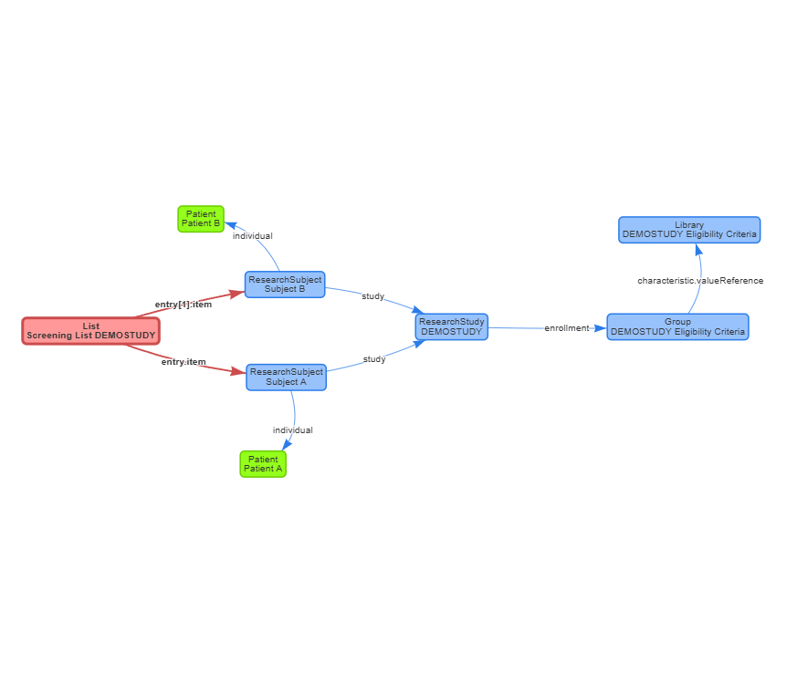

# Trino SQL-based Query Module

!!! warning

    This is an experimental feature that is still under development. Expect breaking changes at any time.

As of version `10.2.0`, it is possible to use recruIT without requiring the OHDSI OMOP stack.
Instead, cohorts can be defined using SQL that is directly executed against FHIR resources.
The prerequisite is that FHIR resources were previously encoded as Delta Lake tables using [Pathling](https://pathling.csiro.au/)
which can then be queried using [Trino](https://trino.io/). The same resources need to exist both as tables and inside a FHIR server
in order for the query module to correctly link them.

The advantage is that no semantic transformation from mapping FHIR resources to the OMOP CDM is necessary.

To create the necessary tables, you can install a Pathling server and use the [`$import` operation](https://pathling.csiro.au/docs/server/operations/import)
to import FHIR bulk exports. You can find a demo setup for this approach at <https://github.com/bzkf/trino-on-fhir> as well.
If you're using Kafka, then <https://github.com/bzkf/fhir-to-lakehouse> is another way.

Because the return values of an SQL query can be arbitrary, the `query-fhir-trino` module assumes that one of the result columns is called `patient_id`
and contains the FHIR ID of the Patient ressource satisfying the eligibility criteria.

The `query-fhir-trino` module is part of both the compose-based setup and the Helm chart deployment but needs to be enabled using `--profile=trino`
for compose, and `query-fhir-trino.enabled=true` for the chart. Both assume that Trino and the required Delta Lake tables are already available.
The best way to try it out with sample data is following [the development setup](../development/contributing.md#setup-for-the-trino-sql-based-query-module).

The diagram below shows the changes compared to the default setup using OMOP:

Instead of using ATLAS, trial metadata is stored by creating FHIR ResearchStudy resources directly.
These studies then reference the elgibility critera as a FHIR Library which includes the SQL query that
encodes the study eligibility criteria.

